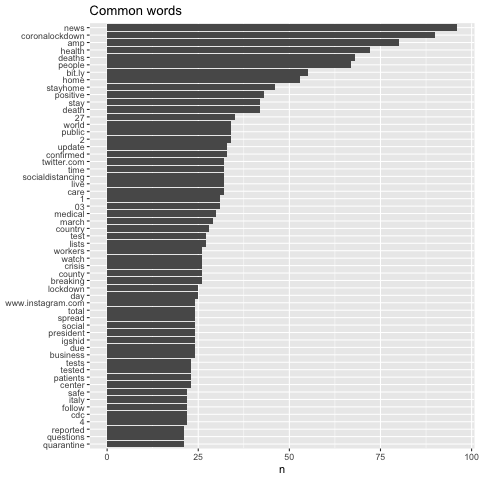
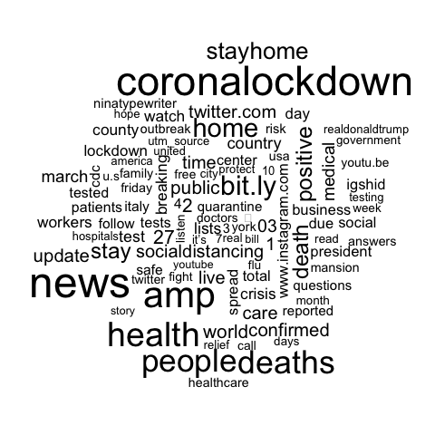
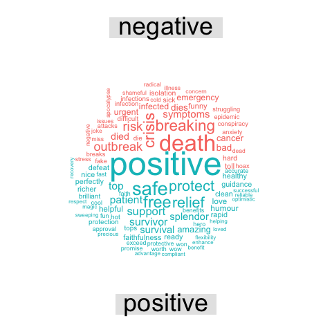

# SBSPS-Challenge-1391-Coronavirus-on-Social-Media-Analyzing-Twitter-Conversations

# General Description 
I analyze more than 25 million real-time tweets on Twitter related to Coronavirus to give up-to-date insights about the pandemic from the lens of social media. How are people reacting to the outbreak? How is Twitter being used to circulate vital information and updates? How is it being abused for spreading false information, panic and hate?

Top Countries (most positive on Twitter) 

Sri Lanka, Maldives, Thailand, Bangladesh, Tanzania, Ghana, Belgium, Zimbabwe, Uganda, Nigeria, Ireland, South Africa, Venezuela, Malaysia Top Countries (most negative on Twitter) 

Hong Kong, Norway, United States of America, Mexico, Chile, Sweden, Brazil, Greece, Nether, Colombia

 

100+ days since the first COVID-19 case in the United States, and 45+ days into the earliest Lockdown Order of California, how have you been feeling through this special time? Do you know how others are responding to the pandemic?

The Corona Virus endangers our physical health indeed, but alongside, social distancing also poses a threat to our emotional stability. Thus, it is crucial to understand public sentiments under COVID-19.

I will deployed Sentiment Analysis on tweets and Topic Modeling on news to aid the understanding of sentiment trends. Based on these, we built dashboards as a daily sentiment monitor product to present the results.

 # Motivation


The Corona Virus endangers our physical health indeed, but alongside, social distancing also poses a threat to our emotional stability. Thus, it is crucial to understand public sentiments under COVID-19.

Uniqueness( Analysis Process)
To study public sentiments, we chose Twitter as our target field. As one of the world’s biggest social network platforms, Twitter hosts abundant user-generated posts, which closely reflect the public’s reactions towards this pandemic with low latency. By deploying Natural Language Processing (NLP) methods on it, we were able to extract and quantify the public sentiments over time. The tools we used are TextBlob, IBM Watson Tone Analyzer, BERT, and Mallet. 
# Business Impact
•        Twitter: As a social media, Twitter takes the responsibility to control negative rumors spreading during this period for the social good. Twitter can monitor the sentiment trends and study the abnormal emotion peaks like what we did.

•       Medical Institutions: Our analysis can help medical institutions know the emotion changes during the COVID-19. Doctors can provide help to people who potential have mental health problem.

•        Business Owners: Keeping a watchful eye on trending topics and people’s emotion change can help business owners run marketing campaign appropriately and find out potential business opportunities, such as new services that needed by people.

# Scope of work


Our analysis has shown some relationships between confirmed cases growth and the trends of sentiments. With more granular data such as geographic data, demographic information and so on, further insights can be generated, such as public sentiment monitoring the hardest-hit areas. With a more specific target, the analysis would be more valuable for institutions or governments to take action.

In this project, we analyzed the sentiments of COVID-19-related tweets in several ways. The overall trend shows that the public has been more optimistic over time. Digging into the multi-dimensional sentiment analysis, we found that the sentiment “Assertive” went up and “Fearful” went down through the time. Besides, the Sentiment Density indicates that the public turned out to be less loaded with emotions. At last, the topics behind the sentiments unfolded more details.

To fight the coronavirus not only needs the guidance from the government but also a positive attitude from the public. Our analysis provides a potential approach to reveal the public’s sentiment status and help institutions respond timely to it.

## Who will benefit by the analysis
- Twitter: As a social media, Twitter takes the responsibility to control negative rumors spreading during this period for the social good. Twitter can monitor the sentiment trends and study the abnormal emotion peaks like what we did. 

- Medical Institutions: Our analysis can help medical institutions know the emotion changes during the COVID-19. Doctors can provide help to people who potential have mental health problem.

- Business Owners: Keeping a watchful eye on trending topics and people’s emotion change can help business owners run marketing campaign appropriately and find out potential business opportunities, such as new services that needed by people. 
## My data source including:

Confirmed Cases:
1. Time searies data of confirmed cases: [Johns Hopkins CSSE](https://github.com/CSSEGISandData/COVID-19) (daily data from 01/16 to 05/02)

Twitter:
1. Tweets on Twitter retrieved with [TwitterScraper API ](https://github.com/taspinar/twitterscraper) (daily data from 01/20 to 04/26)\
  **Note**: the daily data is a sample from each day's tweets, not the population. We sampled out abough 13K tweets for each day, 1.3M in total.
2. Twitter trending topics retrieved by scraping [Trendogate.com](https://trendogate.com) (daily data from 01/20 to 04/11)
3. Number of tweets with #COVID-19 shared by [Tweet Binder](https://www.tweetbinder.com/blog/covid-19-coronavirus-twitter/) 

News:
1. #COVID-19 news scraped from [Fox News](https://www.foxnews.com/) (daily data from 01/20 to 04/26)
2. #COVID-19 news scraped from [CNN](https://www.cnn.com/) (daily data from 01/20 to 04/26)


The datasets can be found in folders. **P.S.** Due to the file size limitation set by Github, we did not upload the combined dataset. To combined the datasets in folders, please try:
```python
# Read raw datas from the raw data file
path = r'------path-------------'
files = os.listdir(path)
covid_twitter_data = pd.DataFrame()
# Concat the Twitters data into one-table
for file in files:
    data = pd.read_csv(str(path) + file)
    covid_twitter_data = covid_twitter_data.append(data, ignore_index=True)
    
```
## Analysis Methods

### Sentiment Analysis

**TextBlob Polarity & Subjectivity Score**: We utilized [TextBlob](https://textblob.readthedocs.io/en/dev/quickstart.html), a popular NLP library, to conduct sentiment analysis by generating polarity score (negative \[-1 ~ +1] positive) and subjectivity score (objective \[0 ~ 1] subjective). 
Examples: 
- 'Great!' Polarity = 1
- 'This is the worst situation.' Polarity = -1
- 'It's raining.' Subjectivity = 0
- 'I love the rain!' Subjectivity = 1


 # COVID-19 Sentiment Analysis

Using Twitter data to perform sentiment analysis on the tweets on the COVID-19 virus.

## Background

The recent Coronavirus COVID-19 has created a global emergency demanding social distancing, working from home, and self quarantining to control the spread of the virus. As a result, in my spare time I decided to explore how people are reacting and talking about the pandemic online.

## Data

For this project, 10000 tweets with the "COVID-19" related keywords between March 20 to March 28 in 2020 were fetched for analysis.

### Keywords

Generic
```
#COVID19
#covid19
#coronavirus
#CoronaVirus
```

More Specific
```
#coronavirustexas
#Coronavirustexas
#coronavirusnewyork
#coronaviruscalifornia
```

### API Method using R

1. Acquire API key and token from [Twitter developer website](https://dev.twitter.com) 
2. Install and load the required R package(s) for collecting and vizualizing Twitter data. Examples: *rtweet, twitteR, vosonSML*. *rtweet* gives most detail in twitter variables (> 90). 
```
rtweet, ggmap, igraph, tidyverse, ggraph, ggplot2, data.table, maps, mapdata
```
3. Store and check the API keys/tokens
4. Check token
5. Search using query
6. Preview data
7. Time series plot

---

## Sentiment Analysis

### Preprocessing

1. The Twitter data obtained is converted to a data frame.
2. The text of the tweets is tokenized, i.e. broken into words. Each row is split such that there is one token (word) in each row of the new data frame.
3. The stopwords are removed from the data.
4. The typical keywords are removed from the data.
5. Sentiment words from the ***Bing Lexicon*** are used for analysing the tweet words.

### Visualization

**Most commonly used words in the tweets**



**Word cloud of the Sentiment words in the tweets**



**Classification of the Sentiment words in the tweets**



---

## Insights

Overall, the tweets convey a mixed, but slightly optimistic sentiment - with the relatively high frequency of words such as "positive", "safe", "relief", "support".
The most frequent words are related to "lockdown", "health", "stayhome", "deaths" stood out among the other words, which suggests that people are talking more about the health and deaths, are much more concerned about the measure to deal with it.


## Analysis Methods

### Sentiment Analysis

**TextBlob Polarity & Subjectivity Score**: We utilized [TextBlob](https://textblob.readthedocs.io/en/dev/quickstart.html), a popular NLP library, to conduct sentiment analysis by generating polarity score (negative \[-1 ~ +1] positive) and subjectivity score (objective \[0 ~ 1] subjective). 
Examples: 
- 'Great!' Polarity = 1
- 'This is the worst situation.' Polarity = -1
- 'It's raining.' Subjectivity = 0
- 'I love the rain!' Subjectivity = 1


**IBM Watson Tone Analyzer**: We choose to use [IBM's Tone Analyzer](https://www.ibm.com/cloud/watson-tone-analyzer?p1=Search&p4=p50290119172&p5=e&cm_mmc=Search_Google-_-1S_1S-_-WW_NA-_-ibm%20tone%20analyzer_e&cm_mmca7=71700000061102158&cm_mmca8=kwd-567122059112&cm_mmca9=EAIaIQobChMI_rr9_f2i6QIVYB6tBh37Ig83EAAYASAAEgJkRfD_BwE&cm_mmca10=405936285071&cm_mmca11=e&gclid=EAIaIQobChMI_rr9_f2i6QIVYB6tBh37Ig83EAAYASAAEgJkRfD_BwE&gclsrc=aw.ds) (a cloud service) to do the sentiment anlysis because it can provide 5 different tones of the text data which is more than positive-negative sentiment analysis. Through this way, we can study the tweets' emotion more specifically. The limitation of this service is that, for each account, we can only analyze 2,500 tweets/email for free, so this method cannot directly be deployed on the whole dataset we have. 

**Google BERT**: To overcome the limitation of IBM Tone Analyzer, we firstly registered multiple emails accounts and utlized the Tone Analyzer to  labeled a sample of data that we sampling randomly from the whole dataset. With adjustment and also combined with our manually labeled data, we used these data as trainning set for the [Google BERT model](https://www.tensorflow.org/hub/tutorials/text_cookbook), a state-of-art machine learning technique for classification. Compared to other alternatives, BERT requires much less time and less data to train, and yields better accuracy. It is a good fit for our case where we have limited training data.

### LDA Topic Modeling


**LDA Topic Modeling**: We leverage [LDA topic modeling](http://www.jmlr.org/papers/volume3/blei03a/blei03a.pdf) technique to summarise the news articles we scraped. We clustered news articles in to [8 topics](https://github.com/xxz-jessica/COVID-19_UCD_Challenge/blob/master/Topic_Modeling/LDA_fox_cnn_colab_topics.xlsx), including economical impact and political actions. Through this way, we can better understand how news articles responsed to COVID-19. The advantage of using news texts for topic modeling instead of tweets is that tweets are short, informal, and highly sentimental, which are hard to process for topic models, while news texts would capture the important events under COVID-19 in a formal and neutral way.

### Limitation 

Besides the IBM's service limitation above, since evaluating a text tone is not a objective thing, the sentiment analysis we conducted is impacted by our subjectivity and the accuracy of IBM Tone Analyzer.
